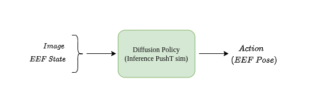
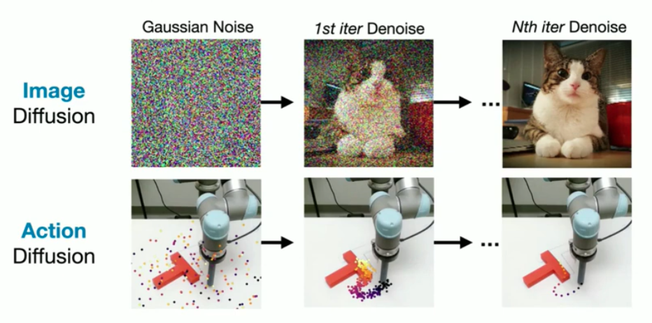
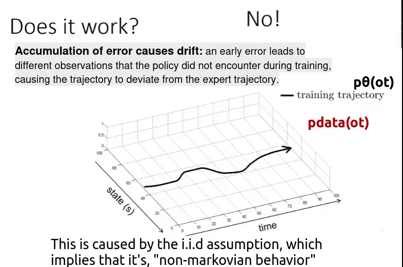
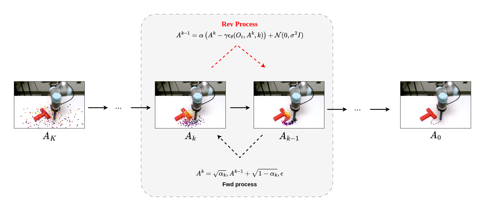

## Introduction
We all know diffusion models like DALL-E and Stable Diffusion for their ability to generate stunning images by iteratively removing noise. But what if we applied that exact same principle to robotic control?
 
Diffusion Policy is a groundbreaking approach to **visuomotor manipulation** that adapts the DDPM architecture to solve imitation learning. Instead of converting a latent vector into an image, it learns to denoise a random sequence into a highly accurate "action chunk"—a trajectory of 7-DoF end-effector poses. By conditioning this denoising process on camera observations rather than text prompts, Diffusion Policy gracefully handles the multi-modal, non-Markovian nature of real-world physics. 
 
 

In this post, we’ll take a step back to review the fundamentals of DDPMs and Imitation Learning, and then connect the dots to see how Score-Based modeling gives Diffusion Policy its edge.

The problem statement Diffusion Policy solves is **Visuomotor Manipulation**, means a imitation learning policy that uses Diffusion Process that performs manipulation tasks given only the **camera frames** and its **current joint state** as input, and predicts a set of action chunks as output. Here “an action chunk” means 7 DoF EEF pose ($\text{[x, y, z, roll, pitch, yaw, gripper]}$). The model predicts a set of $n$ (say $n$=16) actions, meaning that if there are 16 future time steps, the end-effector of the manipulator needs to follow a sequence of poses/action chunks to reach the goal position.

    

The action can be anything like, pick and place objects, stacking objects, Opening a can etc. The paper shows there 11 tasks across 4 simulation environments (see more about this in the paper). These actions data are being collected from expert demonstrations, to train a imitation learning model.

Diffusion Policy(DP), essentially _solves a imitation learning problem by taking inspiration directly from DDPM paper_. Which means to understand DP, we need to first have a basic understanding of Imitation Learning and DDPM. 

    

Here is a short refresher, on both. 

## DDPM Explained

Original purpose of DDPM was to image generation, similar to GAN, VAE or Normalizing Flow. But, unlike others its much stable to train, and generate high quality images, **without the fear of mode collapse**. Almost all image generation models learns how to _convert a latent vector (gaussian noise) to an image in one step_, but in DDPM, the model fundamentally tries to learn how to remove noise from the latent vector over k iterations. Let’s understand how.

    

DDPM has two process **forward process** and **reverse process**, in the forward process we gradually add noise to an sampled image($x_0$) for $k$ steps, and in the reverse process, the model does the exact opposite, it learns to look at a noisy image and figure out how much noise to strip away to restore it.

### **Forward Diffusion Process:**

We gradually add gaussian noise to original image $x_0$ for $T$ steps, and by the time it reaches to $T$, the original image turns into a pure Gaussian noise $x_t \sim N (0, I)$
. This forward diffusion process is described as a _transition probability of getting to a more noisy version of the image ($x_{t-1}$) given the less noisy version ($x_t$)_,

$$
q(x_t \mid x_{t-1}) = \mathcal{N}(x_t; \sqrt{1 - \beta_t} \, x_{t-1}, \beta_t I)
$$

Here, $\beta_t$ is the noise schedule, means it decides how much noise to add at time step $t$. 

Using re-prametrizaiton trick we can, estimate $x_t$ given any arbitrary time step $t$ and $x_0$. 

$$
\begin{align}x_t  &= \sqrt{\bar{\alpha}_t}\, x_0 + \sqrt{1 - \bar{\alpha}_t}\,\epsilon \\q(x_t \mid x_0)  &= \mathcal{N}\!\left(x_t;\, \sqrt{\bar{\alpha}_t}\, x_0,\; (1 - \bar{\alpha}_t)\mathbf{I}\right)\end{align}
$$

For further understanding of the derivation [follow this](https://lilianweng.github.io/posts/2021-07-11-diffusion-models/#:~:text=A%20nice%20property,%3A).

### What is Re-prametrizaiton Trick?

To sample from $\mathcal{N}(\mu, \sigma^2)$, you can write:

$$
x = \mu + \sigma \epsilon, \quad \epsilon \sim \mathcal{N}(0,1)

$$

Applying this to our forward process:

$$
x_t = 
\underbrace{\sqrt{1 - \beta_t}\, x_{t-1}}_{\text{mean}}
+
\underbrace{\sqrt{\beta_t}\, \epsilon}_{\substack{\text{std dev \&} \\ \text{Gaussian Noise}}}
$$

    

### **Reverse Diffusion Process:**

Similarly there is Reverse Diffusion Process, in which we try to _retrieve the less noisy version of the image ($x_{t-1}$) given the more noisy version of the image ($x_t$)_. As you can see this is the reverse of the forward process, where we try to predict the amount of noise added, to get back the the previous step($x_{t-1}$). The transition probability of getting to a less noisy version of the image $x_{t-1}$ from more noisy image ($x_t$) is, 

$$
p_\theta(x_{t-1} \mid x_t) = \mathcal{N}\!\left(x_{t-1}; \mu_\theta(x_t, t), \Sigma_\theta(x_t, t)\right)
$$

Here, $\mu_{\theta}$ and $\Sigma_{\theta}$ are the models that predicts the mean and variance of $x_{t-1}$, given the $x_t$ and $t$. In the DDPM paper, we only predict the mean($\mu_{\theta}$), and keep the variance fixed. 

$$
\begin{align}p_\theta(x_{t-1} \mid x_t) &= \mathcal{N}(x_{t-1}; \mu_\theta(x_t, t), \Sigma) \tag{3} \\x_{t-1} &= \mu_\theta(x_t, t) + \Sigma \odot z,\quad z \sim \mathcal{N}(0,I) \tag{4}\end{align}
$$

Well, predicting the mean is good and all, but at the beginning, we understood that at its core reverse diffusion model, is all about predicting the noise that’s been use to transition from $x_{t-1}$ to $x_t$, but here we are predicting the mean, how that make sense. 

**In my opinion this is the most interesting part of all the derivations,** the mean of the gaussian $p_\theta(x_{t-1} \mid x_t)$ is derived from the predicted noise $\epsilon_\theta(x_t, t)$, using a closed-form relation between forward and reverse process, which is very similar to the re-parameterization equation from before.

$$
\begin{align}
x_{t-1} &= \frac{1}{\sqrt{\alpha_t}} \left( x_t - \frac{1-\alpha_t}{\sqrt{1-\bar{\alpha}_t}} \epsilon_\theta(x_t,t) \right) + \sigma_t z \tag{5} \\
\mu_\theta(x_t,t) &= \frac{1}{\sqrt{\alpha_t}} \left( x_t - \frac{1-\alpha_t}{\sqrt{1-\bar{\alpha}_t}} \epsilon_\theta(x_t,t) \right) \tag{6}
\end{align}
$$

It is c**onceptually similar** to **Langevin dynamics**, as it has a deterministic "drift toward data" term plus a noise term. Note that the above equation expresses $\mu_\theta$ in a closed form using $\epsilon_\theta$. This means you need the predicted noise value first to calculate the mean, which is then added to $x_t$ to retrieve $x_{t-1}$ using equation 4.

For further understanding of the derivation [follow this](https://lilianweng.github.io/posts/2021-07-11-diffusion-models/#:~:text=Recall%20that%20we,%3A).

**Stochastic gradient Langevin dynamics (SGLD)** is used in the reverse process for sampling/generation. Think about SGLD as a technique that enhances stochastic gradient descent by injecting noise, enabling efficient sampling from complex distributions during the reverse process while aiding convergence to the target posterior. 

$$
x_t = x_{t-1} + \frac{\delta}{2} \nabla_x \log p(x_{t-1}) + \sqrt{\delta} \epsilon_t, \quad \text{where} \ \epsilon_t \sim \mathcal{N}(0,I)
$$

> We can understand the SGLD equation better with this example,

Consider the 2D Gaussian distribution $p(x,y) = \frac{1}{2\pi} \exp\left(-\frac{x^2 + y^2}{2}\right)$. Its gradient is $\nabla p(x,y) = p(x,y) \cdot [-x, -y]$, which multiplies the direction by the probability density itself. In contrast, the score function simplifies to $\nabla \log p(x,y) = [-x, -y]$.
> 
> 
> At point (3, 0), where $p(3,0) \approx 0.0013$, $\nabla p$ becomes tiny ($[-0.0039, 0]$) because it is scaled by this low probability value, causing vanishing gradients far from the peak. Meanwhile, $\nabla \log p(3,0) = [-3, 0]$ stays strong and grows with distance. This is exactly why diffusion models (like DDPM) learn to predict the score $\nabla \log p$ instead of the raw gradient of $p$.
> 

And finally the model is trained on the $L_2$ loss between the noise added to $x_{t-1}$ (we get from forward diffusion process) $\ \epsilon_t$ and the estimated noise $\epsilon_\theta(x_t, t)$,

$$
\left|| \epsilon_{\theta}(x_{t}, t) - \epsilon_t \right||^{2}
$$

## Imitation Learning Basics Explained

General though behind Imitation Learning is, given an image $o$ we predict the label $a$, using a model $\pi_{\theta}$, and its modelled as $\pi_{\theta}(a \mid o)$ , where $\theta$ represents the model parameters. Imitation learning is almost supervised learning, with a caveat.

In a image classification task the $a$ is the predicted class, and in control problem $a$ is the predicted action. But note that, 

- In classification task, the input data distribution ($D = \{(o_i, a_i)\}_{i=1}^n$) follows IID (Independent and identical distribution), which means that the model’s prediction ($a$), doesn't influence input ($o$).
- In contrast to that, in control problem, data distribution doesn't follow IID, the model’s prediction actively influences the environment ($o$ observation).

> ***Take Away:*** Our actions influence future observations
> 

### Whats the Problem with Imitation Learning?

Now here is the deal, imitation learning, works in practice but doesn't work in theory. Why?

    

Suppose you have a policy ( $\pi_{\theta}$ ) trained on the black trajectory. But when you deploy it in the real world, you observe **cumulative drift** — small errors over time that eventually lead to a large deviation. As a result, the model follows a completely different trajectory (the red trajectory).

Even though we start from the same initial state as in the training data, future observations depend on the current action (non-IID setting). If the policy makes a small mistake, it leads to a slightly different observation. That new observation may not exist in the training data, causing another small mistake.

Over time, this chain of small errors grows into a large deviation from the original trajectory. So the bottom line is,

$$
p_{data}(o_t) \neq p_{\pi_{\theta}}(o_t)
$$

Means the “distribution of the observation ($o_t$) in trained data“  is different from “distribution of the observation ($o_t$) when the policy is executed“. This is caused by two reasons,

1. **Non-Markovian Behaviour:** The policy's optimal action depends on **history**, not just the current observation — i.e. $\pi(a_t \mid o_{t-T_o:t})$ rather than $\pi(a_t \mid o_t)$, here $T_o$ is the window size, and observation is an window of $T_o$ elements ending at $t$.
2. **Multi-modal Behaviour:** The same observation $o_t$ can legitimately lead to **multiple different valid actions**

    

Diffusion Policy solves both the problems by,

1. **Predicting a sequence of actions**, which helps capture non-Markovian behaviour in real-world tasks.

    

1. Using Diffusion Models to learn a multi-modal action distribution helps capture Multi-modal Behaviour in demonstrations.

    

## DDPM and Diffusion Policy Relation

DDPM is adapted for Diffusion Policy in an imitation learning style. Just as image generation conditions on text to produce an image, here the **action is conditioned on observation** $o$ (image) to produce $a_t$ in a **non-iid** sequential setup. This is the only fundamental change from vanilla DDPM, the denoising process is conditioned on $o$ instead of text.

    

Following this, the Forward process is described as,

$$
A_t^k = \sqrt{\bar{\alpha}_k}, A_t^0 + \sqrt{1 - \bar{\alpha}_k}, \epsilon, \quad \epsilon \sim \mathcal{N}(0, I)
$$

And similarly we get Reverse Process as,

$$
A^{k-1} = \alpha \left( A^k - \gamma \epsilon_\theta (O_t, A^k, k) \right) + \mathcal{N}(0, \sigma^2 I)
$$

**Only change is**, $\epsilon_\theta (O_t, A^k, k)$ is being used in place of $\epsilon_\theta(x_t,t)$ ($A^k$ and $x_t$ are same). Here, the noise is **not only** a function of action $A^k$ and iteration $k$ **but also takes $O_t$**  into consideration (obviously as its a control problem). Here, action is defined as “A chunk of actions”, which is nothing but **sequential end-effector (EEF) pose**, that are passed to a **mid-level controller** that solves **differential kinematics (IK)** to compute the necessary joint positions to reach that pose.

$$
\begin{align*}
A_t &= [a_t, a_{t+1}, a_{t+2}, \dots, a_{t+H_p-1}] \in \mathbb{R}^{H_p \times d_a} \\
a_t &= [x, y, z, \phi, \theta, \psi, g] \in \mathbb{R}^7
\end{align*}
$$

Action $a_t$ is defined as 3D pose + extra (g, gripper close/open). The authors tested with velocity control space also, but the ***position control policy outperformed velocity control policy consistently***.

## Energy Based Model for Manipulation (IBC)

Paper also talks about why ***implicit behaviour cloning (IBC) model is unstable training,*** compared to Diffusion Policy. The story it tells is same as why we use score based models over energy based models, as IBC is based on energy based model and Diffusion Policy is score based. 

    

Energy based models represents implicit policy, where the model learn a energy function, then optimize to find best action. Lets understand its basics, step by step.

**1st - Learning the Energy Function:** 

Given the observation $o$ and action $a$ we first try to learn the **Energy function** $E_{\theta}(o,a)$, to output a **scalar badness score**. The blue and white graph on the right is the energy function, learned through **contrastive learning**. The model gives **high score for bad actions**, and **low for good ones**. 

    

**2nd - Inference Through Optimization:**

Action predicted using $E_{\theta}(o,a)$ is **not a one-to-one mapping**—it's **one-to-many**, because the observation vs action landscape is **multi-modal** (see the black c curve in the image below): given a single observation $o$ there can be **multiple optimal actions** to take. That's why we need to perform **optimization** (e.g. gradient descent). The left part of the image shows that. 

An implicit policy represents the “action distribution $p(a \mid o )$” defined as Energy-Based Model (EBM):

$$
p_{\theta}(a \mid o) = \frac{e^{-E_{\theta}(o,a)}}{Z(o,\theta)}
$$

**Difference between EBM** ($p_{\theta}$) **and** $E_{\theta}$: $E_{\theta}$ gives a **scalar value** (energy of the action), but $p_{\theta}$ is the **probability density** of the action given observation $o$. 

- If actions are **discrete** (K possible actions), $p_\theta$ is a **K-dimensional vector of probabilities**.
- If actions are **continuous** → $p_{\theta}$ is a **probability density over a d-dimensional space**.

## Transition: Energy Score Based Model → Score Based Model

Here, $p_{\theta}$ describes the **action distribution** given the observation and the Energy function $E_{\theta}$. This equation is similar to the pdf of a Gaussian distribution, but the **coefficient $Z_{\theta}$** and the **exponent of $e$** are unknown. In the 2D Gaussian pdf,

$$
f(x) = \frac{1}{\sigma \sqrt{2\pi}} \exp\!\left( -\frac{1}{2} \left( \frac{x - \mu}{\sigma} \right)^2 \right)
$$

Here, 

 $E_{\theta}(o,a) = \frac{1}{2} \left( \frac{x - \mu}{\sigma} \right)^2$ (How "far" from the mean )

$Z(o, \theta) = \sigma{\sqrt{2\pi}}$  (A normalization constant, that ensures the probability integrates to 1)

In energy based model the $E_{\theta}$ is being learned, and Estimating $Z$ analytically is intractable, because $E_θ(o,a)$ is a neural network, a complicated, nonlinear function, with  no closed form.

$$
\int p_{\theta}(x)\, dx = 1
 \\ Z = \int_a e^{-E_{\theta}(o,a)} \, da 

$$

In IBC you use certain tricks like **InfoNCE-style loss**, which uses negative log-likelihood with **negative samples** to estimate the **intractable normalization constant $Z$**. That is exactly why **IBC training is unstable**.

**Diffusion Policy**, in contrast, follows DDPM—a **score-based model**. Score-based models optimize the **score function** $s_{\theta}$,

$$
s_{\theta}(a) \approx \nabla_a \log p(a|o)
$$

Remember the energy-based model:

$$
p_{\theta}(a \mid o) = \frac{e^{-E_{\theta}(o,a)}}{Z(o,\theta)}
$$

Taking log:

$$
\log p(a|o) = -E(o,a) - \log Z
$$

The whole point of the score in diffusion/DDPM is to guide **action sampling,** so you differentiate w.r.t. $a$.

$$
\nabla_{\mathbf{a}} \log p(a|o) = -\nabla_{a} E(o,a) - \underbrace{\nabla_{\mathbf{a}} \log Z}_{= 0}
$$

So, score = $−∇_oE(o)$

And since $Z$ depends on $o$ and $\theta$ but **not on $a$,** the $\nabla_{\mathbf{a}} \log Z = 0$.

## Diffusion Policy

**Diffusion Policy** is described as **“closed-loop action-sequence predictor"**, because you take **observation (images) as input/feedback**. The diffusion model produces **receding horizon control**: at time step $t$, the model takes $T_o$ steps of input $O_t$ and predicts $T_p$ steps of actions, of which **$T_a$ steps are executed without re-planning**. By receding horizon control, it implies to the behaviour of not executing the entire predicted action sequence.

I think rather than predicting single action command individually, this **predicts a sequence of actions altogether**, which makes it **temporally consistent**; Diffusion Policy **denoises the entire action sequence**, which also helps with temporal consistency.

1. **General implicit policy models** take **“previous action + current observation”** to predict the future action. Its more like saying,
    
    > *"If I make good decisions at each timestep independently, the trajectory will be fine"*
    > 
2. **Diffusion Policy**, in contrast, **denoises the entire action sequence in one go**—more like saying,
    
    > *"A good trajectory is a coherent sequence, model it as a whole"*
    > 

This is the general diagram given in the DP paper. Here **$\epsilon_{\theta}(o,a)$ is the noise prediction network**. The predicted "noise" is actually the **score** ($-∇_a \log {p(a \mid o)} \approx ∇ E (a)$ ). This is used directly in **equation 1**, in place of $ε_θ(x^k, k)$ to calculate the $k-1$ denoising step’s action sequence. 

    

Here,

1. $\mathbf{a} = [a_1, a_2, a_3, …, a_{T_a} , a_{T_p}]$ ( $T_p$ steps of actions, at time $t$)

2. $O_t = [o_t, o_{t-1}, ..., o_{t-T_o+1}]$ ($T_o$ most recent observations, diagram $O = O_t$)

Only $T_a$ steps are being executed, $[a_1, a_2, a_3, …, a_{T_a}]$

After $a_{T_p}$ is being executed, then we take new observations and again predict actions for $T_p$ steps. 

Note: the model is not auto-regressive, the predicted noise gets converted to action using reverse process and that goes inside for k-th denoising iteration.

## Discussions
The diffusion policy action prediction rate is around 2Hz, and it takes quite a few episodes to train the model properly. At the time of publishing, there were already better methods in visuomotor policy learning, such as $\pi_0$, GR00T N1.x, ACT, etc., many of which use Flow Matching objectives that are significantly faster. However, as it is a fundamental work on the path toward VLAs, I thought it was worth reading.

I have only read the paper and referenced blogs/videos I could find online, and taking with grok and claude to understand the concepts — due to time constraints, I was not able to go through the Diffusion Policy codebase. Therefore, if you find any mistakes, please let me know and I will try to fix them.

## Resources
- [Diffusion Policy: Visuomotor Policy Learning via Action Diffusion — Part I: Foundations](https://medium.com/@sm.sat/diffusion-policy-visuomotor-policy-learning-via-action-diffusion-paper-code-review-7b21486ccd99)
- [What are Diffusion Models? by Lilian Wang](https://lilianweng.github.io/posts/2021-07-11-diffusion-models/)
- [Generative Modeling by Estimating Gradients of the Data Distribution
](https://yang-song.net/blog/2021/score/)
- [Diffusion Policy: LeRobot Research Presentation #2 by Cheng Chi
](https://youtu.be/M03sZFfW-qU?si=R0Cz5EUnw0yRtF__)